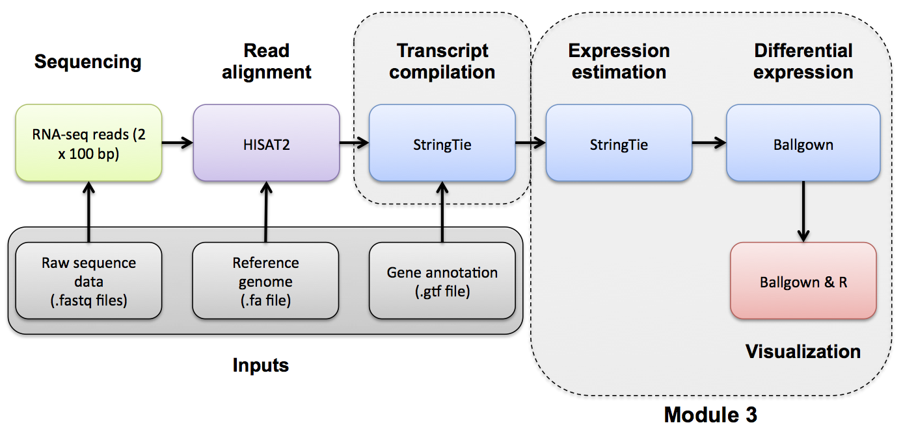

#3-ii. Differential Expression
Use Cuffmerge and Cuffdiff to compare the tumor and normal conditions. Refer to the Cufflinks manual for a more detailed explanation:
* http://cole-trapnell-lab.github.io/cufflinks/cuffmerge/index.html
* http://cole-trapnell-lab.github.io/cufflinks/cuffdiff/index.html

Cuffmerge basic usage:
```bash

cuffmerge [options]* <assembly_GTF_list.txt>

```

* "assembly_GTF_list.txt" is a text file "manifest" with a list (one per line) of GTF files that you would like to merge together into a single GTF file.

Extra options specified below:

* '-p 8' tells cuffmerge to use eight CPUs
* '-o' tells cuffmerge to write output to a particular directory
* '-g' tells cuffmerge where to find reference gene annotations. It will use these annotations to gracefully merge novel isoforms (for de novo runs) and known isoforms and maximize overall assembly quality.
* '-s' tells cuffmerge where to find the reference genome files

Merge all 6 cufflinks results so that they will have the same set of transcripts for comparison purposes

```bash

cd $RNA_HOME/expression/cufflinks/ref_only/
ls -1 *Rep*/transcripts.gtf > assembly_GTF_list.txt
cuffmerge -p 8 -o merged -g $RNA_HOME/refs/hg19/genes/genes_chr22_ERCC92.gtf -s $RNA_HOME/refs/hg19/fasta/chr22_ERCC92/chr22_ERCC92.fa assembly_GTF_list.txt

```

Cuffdiff basic usage:

```bash

cuffdiff [options] <transcripts.gtf> <sample1_hits.sam> <sample2_hits.sam> [... sampleN_hits.sam]

```

* Supply replicate SAMs as comma separated lists for each condition:
 * Example: sample1_rep1.sam,sample1_rep2.sam,...sample1_repM.sam
* '-p 8' tells cuffdiff to use eight CPUs
* '-L' tells cuffdiff the labels to use for samples

Create necessary directories:

```bash

cd $RNA_HOME/
mkdir -p de/cufflinks/ref_only
cd $RNA_HOME/de/cufflinks/ref_only/

```

Generate the cuffquant binary format files for cuffdiff

```bash

cuffquant -p 8 --library-type fr-firststrand --no-update-check -o UHR_Rep1 $RNA_HOME/expression/cufflinks/ref_only/merged/merged.gtf $RNA_HOME/alignments/hisat2/UHR_Rep1.bam
cuffquant -p 8 --library-type fr-firststrand --no-update-check -o UHR_Rep2 $RNA_HOME/expression/cufflinks/ref_only/merged/merged.gtf $RNA_HOME/alignments/hisat2/UHR_Rep2.bam
cuffquant -p 8 --library-type fr-firststrand --no-update-check -o UHR_Rep3 $RNA_HOME/expression/cufflinks/ref_only/merged/merged.gtf $RNA_HOME/alignments/hisat2/UHR_Rep3.bam

cuffquant -p 8 --library-type fr-firststrand --no-update-check -o HBR_Rep1 $RNA_HOME/expression/cufflinks/ref_only/merged/merged.gtf $RNA_HOME/alignments/hisat2/HBR_Rep1.bam
cuffquant -p 8 --library-type fr-firststrand --no-update-check -o HBR_Rep2 $RNA_HOME/expression/cufflinks/ref_only/merged/merged.gtf $RNA_HOME/alignments/hisat2/HBR_Rep2.bam
cuffquant -p 8 --library-type fr-firststrand --no-update-check -o HBR_Rep3 $RNA_HOME/expression/cufflinks/ref_only/merged/merged.gtf $RNA_HOME/alignments/hisat2/HBR_Rep3.bam

```

Perform UHR vs. HBR comparison, using all replicates, for known (reference only mode) transcripts:

```bash

cuffdiff -p 8 -L UHR,HBR -o $RNA_HOME/de/cufflinks/ref_only/ --library-type fr-firststrand --no-update-check $RNA_HOME/expression/cufflinks/ref_only/merged/merged.gtf UHR_Rep1/abundances.cxb,UHR_Rep2/abundances.cxb,UHR_Rep3/abundances.cxb HBR_Rep1/abundances.cxb,HBR_Rep2/abundances.cxb,HBR_Rep3/abundances.cxb

```

What does the raw output from Cuffdiff look like?

```bash

cd $RNA_HOME/de/cufflinks/ref_only
ls -l
head isoform_exp.diff
grep -P "gene_id|OK" isoform_exp.diff | cut -f 2-6,8-10,12 | sort -k 9,9 | less -S

```

Press 'q' to exit the 'less' display

How many genes are there on this chromosome?

```bash

grep -v gene_id gene_exp.diff | wc -l

```

How many were detected above 0 in UHR or HBR (take the sum of expression values for both and check for greater than 0)?

```bash

grep -v gene_id gene_exp.diff | perl -ne '@line=split("\t", $_); $sum=$line[7]+$line[8]; if ($sum > 0){print "$sum\n";}' | wc -l

```

How many differentially expressed genes were found on this chromosome (p-value < 0.05)?

```bash

grep -v gene_id gene_exp.diff | cut -f 12 | perl -ne 'if ($_ < 0.05){print "$_"}' | wc -l

```

Display the top 20 DE genes. Look at some of those genes in IGV - do they make sense?

```bash

grep -P "OK|gene_id" gene_exp.diff | sort -k 12n,12n | head -n 20 | cut -f 3,5,6,8,9,10,12,13,14

```

Save all genes with P<0.05 to a new file.

```bash

grep -P "OK|gene_id" gene_exp.diff | sort -k 12n,12n | cut -f 3,5,6,8,9,10,12,13,14 | perl -ne '@data=split("\t", $_); if ($data[6]<=0.05){print;}' > DE_genes.txt

```

| [[Previous Section|Expression]] | [[This Section|Differential-Expression]]            | [[Next Section|DE-Visualization]] |
|:-------------------------------:|:---------------------------------------------------:|:-----------------------------------------:|
| [[Expression|Expression]]       | [[Differential Expression|Differential-Expression]] | [[DE Visualization|DE-Visualization]] |
