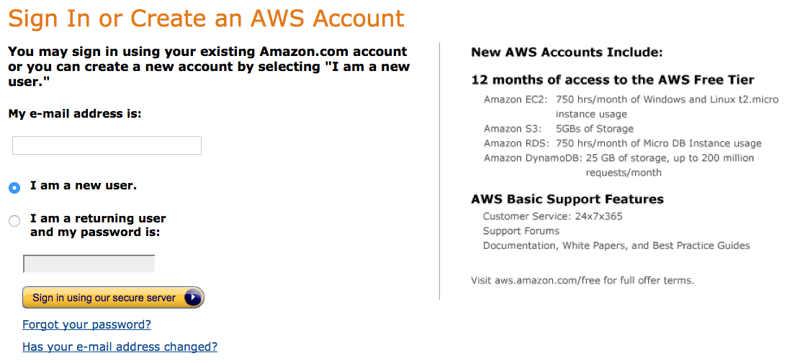

#Introduction to AWS Cloud Computing

###Preamble
Cloud computing allows users to quickly access an arbitrary amount of compute resources from a distance without the need to buy or maintain hardware themselves. There are many cloud computing services. This tutorial describes the use of Amazon's Web Services ([AWS](http://aws.amazon.com/)) elastic compute (EC2) resource. 

###Glossary and abbreviations
AWS
EC2
EBS
S3

###What do I need to perform this tutorial?
To complete this tutorial, you will need a computer with access to the internet, a Web Browser, and a command line terminal application. We are going to access the Amazon EC2 console in your web browser and use it to configure and rent a remote computer from Amazon. We are then going to log into that computer from the command line. The computer you are working on can be almost anything and could be running Windows, Mac OSX, or Linux. The computer that we configure and rent from Amazon will be a Linux machine (though there are many other possibilities). You will use the terminal application on your computer to remotely log into this computer. The Amazon AWS computer you rent will be physically located somewhere that is likely far away from you. Depending on the 'Region' you select in Amazon AWS it could be physically located in one of several large compute warehouses in the North America, South America, Europe or Asia.   

There are two types of knowledge you will be exposed to in this tutorial.  First, use of the Amazon AWS EC2 web console. AWS documentation has a lot of specific jargon and technical concepts. Becoming proficient in AWS EC2 usage is like becoming a very particular kind of system administrator. Everything we do in a web browser using the EC2 console can also be accomplished at the command line using the [Amazon EC2 API tools](https://aws.amazon.com/developertools/Amazon-EC2/351). That is a subject for a more advanced tutorial.

Second, since we are going to create an Amazon instance that is running a Linux you will need to learn the basics of working at a Linux command line.  You will also need to become familiar with basic fundamentals of Linux system administration.
 
###Creating an account
In order to use AWS the first time, you will have to create an account. In order to create and run instances as described in this tutorial, you will need to associate a credit card with that account for billing purposes. Refer to the sections below on how billing works, how to estimate costs, and how to ensure that you have properly shut down everything that you could be billed for.

###Logging into the AWS console
To log into AWS, go to the [aws.amazon.com](http://aws.amazon.com/) and hit the [Sign In to the Console](https://console.aws.amazon.com/console/home) button as shown below.  Once you are logged in, select `EC2` from the list of Amazon Web Services. This tutorial is entirely focused on `EC2` (with some mention of `S3`) so the `EC2` console will be the starting point for many of the activities described below.   

***
AWS home:

***
AWS log in:

***
List of AWS services (select EC2 for this tutorial):

***
The AWS EC2 dashboard:

***

###What is a Region?
An AWS `Region` is set of compute resources that Amazon maintains. Each `Region` corresponds to a physical warehouse of compute hardware (computers, storage, networking, etc.). At the time of writing there are 8 regions: `(US East (N.Virginia)`, `US West (Oregon)`, `US West (N. California)`, `EU (Ireland)`, `EU (Frankfurt)`, `Asia Pacific (Singapore)`, `Asia Pacific (Tokyo)`, `Asia Pacific (Sydney)`, and `South America (Sao Paulo)`.  When you are logged into the AWS EC2 console you are always operating in one of these 8 regions. The current region is shown in the upper right corner of the console between the `User` menu and `Support` menu. It is important to pay attention to what region you are using for several reasons. First, when you launch an EC2 instance, this happens in a specific region. If you switch regions later, you will not see this instance. To find info in the console you will have to switch back to the region where that instance was created. The same reasoning applies for EBS volumes, AMIs, and other resources. These are tracked within a region. Second, the cost to use many AWS resources varies by region. Third, since each region is located in a different part of the world, this may influence network performance when you are accessing the instance and especially if you need to transfer large amounts of data in or out. For example, if you are working in the US and you are going to be uploading RNA-seq data to EC2 instances, it probably does not make sense to create those instances in `Asia Pacific (Sydney)`. Generally you should choose a region that is close to you or your users. But cost is also a consideration. It is important to be aware of regions when it comes to billing because if you are using resources in multiple regions it is easy to lose track of what you have running and you might wind up paying for something that you forgot to shut down. We will discuss billing and cost in further detail below.   

***
The `Region` menu in the EC2 console:

***

###How much does it cost?
EC2 

###How does billing work?

###What are Security Groups and how do they work?

###What is a Key Pair and how does it work?

###Storage volumes. What is ephemeral storage? What is EBS backed storage? What is S3 storage?

###How do storage volumes appear within a Linux instance on Amazon EC2?

###What is difference between the 'Start', 'Stop', 'Reboot', and 'Terminate' (Instance States)?

###Acknowledgements
Creation of this tutorial on Amazon AWS EC2 was generously supported by [Amazon AWS Education grants](http://aws.amazon.com/grants/).