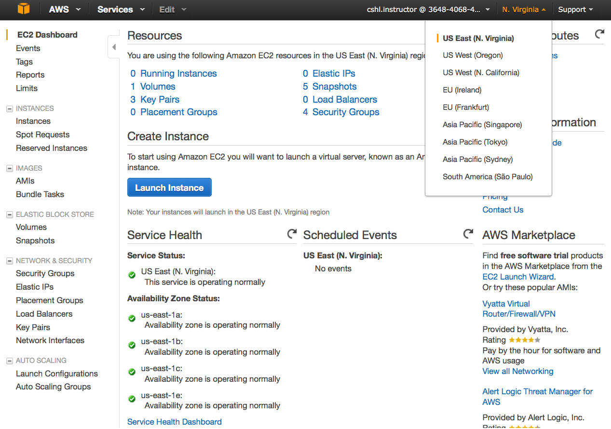
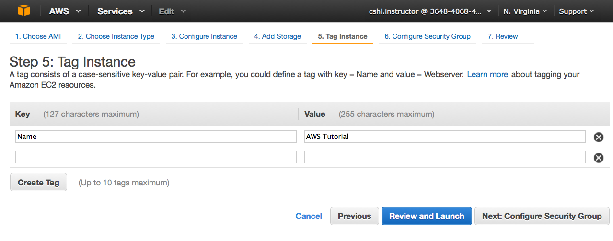
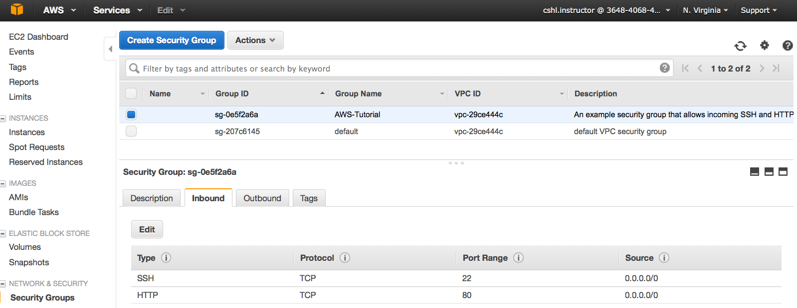
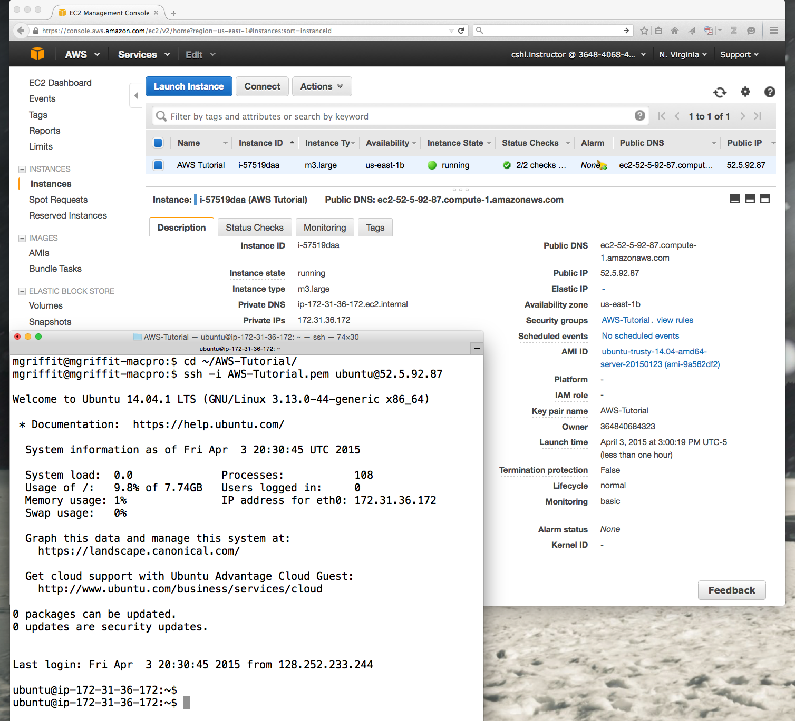

#Introduction to AWS Cloud Computing

###Preamble
Cloud computing allows users to quickly access an arbitrary amount of compute resources from a distance without the need to buy or maintain hardware themselves. There are many cloud computing services. This tutorial describes the use of Amazon's Web Services ([AWS](http://aws.amazon.com/)) elastic compute ([EC2](http://aws.amazon.com/ec2/)) resource. However, the fundamental concepts covered here will generally apply to other cloud computing services such as [Google Cloud](https://cloud.google.com/), [Digital Ocean](https://www.digitalocean.com/), etc., though with substantial differences in jargon used by each provider.

###Glossary and abbreviations
* [AWS](http://aws.amazon.com/) - Amazon Web Services. A collection of cloud computing services provided by Amazon. 
* [EC2](http://aws.amazon.com/ec2/) - Elastic Compute. A particular AWS that provides 'resizable cloud hosting services'. This service allows you to configure and rent computers to meet you compute needs.
* [EBS](http://aws.amazon.com/ebs/) - Elastic Block Storage. A data storage solution offered through the EC2 service. This service allows you to rent disk storage and associate that storage with your compute resources.
* [S3](http://aws.amazon.com/s3/) - Simple storage service. A storage service that is cheaper than EBS and allows for storage of larger amounts of data with some drawbacks compared to EBS.
* [SSD](http://en.wikipedia.org/wiki/Solid-state_drive) - Solid state drive. A particular type of storage hardware that is generally faster and more expensive than traditional hard drives.
* [HDD](http://en.wikipedia.org/wiki/Hard_disk_drive) - Hard disk drive. A particular type of storage hardware that is generally cheaper and larger but slower than SSD. These drives traditional hard drives access data on a spinning magnetic disk.
* [Ephemeral storage](http://stackoverflow.com/questions/11566223/what-data-is-stored-in-ephemeral-storage-of-amazon-ec2-instance) - Data storage associated with an EC2 instance that is either SSD or HDD and *does not persist* when the instance is stopped or terminated. In other words, anything you store in this way will be lost if the system is stopped or terminated.

###What do I need to perform this tutorial?
To complete this tutorial, you will need a computer with access to the internet, a Web Browser, and a command line terminal application. We are going to access the Amazon EC2 console in your web browser and use it to configure and rent a remote computer from Amazon. We are then going to log into that computer from the command line. The computer you are working on can be almost anything and could be running Windows, Mac OSX, or Linux. The computer that we configure and rent from Amazon will be a Linux machine (though there are many other possibilities). You will use the terminal application on your computer to remotely log into this computer. The Amazon AWS computer you rent will be physically located somewhere that is likely far away from you. Depending on the 'Region' you select in Amazon AWS it could be physically located in one of several large compute warehouses in the North America, South America, Europe or Asia.   

There are two types of knowledge you will be exposed to in this tutorial.  First, use of the Amazon AWS EC2 web console. AWS documentation has a lot of specific jargon and technical concepts. Becoming proficient in AWS EC2 usage is like becoming a very particular kind of system administrator. Everything we do in a web browser using the EC2 console can also be accomplished at the command line using the [Amazon EC2 API tools](https://aws.amazon.com/developertools/Amazon-EC2/351). That is a subject for a more advanced tutorial.

Second, since we are going to create an Amazon instance that is running a Linux you will need to learn the basics of working at a Linux command line.  You will also need to become familiar with basic fundamentals of Linux system administration.
 
###Creating an account
In order to use AWS the first time, you will have to create an account. In order to create and run instances as described in this tutorial, you will need to associate a credit card with that account for billing purposes. Refer to the sections below on how billing works, how to estimate costs, and how to ensure that you have properly shut down everything that you could be billed for.

###Logging into the AWS console
To log into AWS, go to the [aws.amazon.com](http://aws.amazon.com/) and hit the [Sign In to the Console](https://console.aws.amazon.com/console/home) button as shown below.  Once you are logged in, select `EC2` from the list of Amazon Web Services. This tutorial is entirely focused on `EC2` (with some mention of `S3`) so the `EC2` console will be the starting point for many of the activities described below.   

***
**AWS home:**

***
**AWS log in:**

***
**List of AWS services (select EC2 for this tutorial):**

***
**The AWS EC2 dashboard:**

***

###What is a Region?
An AWS `Region` is set of compute resources that Amazon maintains. Each `Region` corresponds to a physical warehouse of compute hardware (computers, storage, networking, etc.). At the time of writing there are 8 regions: `(US East (N.Virginia)`, `US West (Oregon)`, `US West (N. California)`, `EU (Ireland)`, `EU (Frankfurt)`, `Asia Pacific (Singapore)`, `Asia Pacific (Tokyo)`, `Asia Pacific (Sydney)`, and `South America (Sao Paulo)`.  When you are logged into the AWS EC2 console you are always operating in one of these 8 regions. The current region is shown in the upper right corner of the console between the `User` menu and `Support` menu. It is important to pay attention to what region you are using for several reasons. First, when you launch an EC2 instance, this happens in a specific region. If you switch regions later, you will not see this instance. To find info in the console you will have to switch back to the region where that instance was created. The same reasoning applies for EBS volumes, AMIs, and other resources. These are tracked within a region. Second, the cost to use many AWS resources varies by region. Third, since each region is located in a different part of the world, this may influence network performance when you are accessing the instance and especially if you need to transfer large amounts of data in or out. For example, if you are working in the US and you are going to be uploading RNA-seq data to EC2 instances, it probably does not make sense to create those instances in `Asia Pacific (Sydney)`. Generally you should choose a region that is close to you or your users. But cost is also a consideration. It is important to be aware of regions when it comes to billing because if you are using resources in multiple regions it is easy to lose track of what you have running and you might wind up paying for something that you forgot to shut down. We will discuss billing and cost in further detail below.   

***
**The `Region` menu in the EC2 console:**

***

###How much does it cost to use AWS EC2 resources?
Estimating the cost to use AWS resources can get complicated.  For the most part when you launch an EC2 instance or create an EBS or S3 volume, you are renting and reserving that resource. You will generally be charged for as long as you reserve that resource regardless of how you use it. For example, if you rent an 8-core machine with 1Tb of disk, and 64Gb of RAM, once you boot that machine you will be charged an hourly rate for as long as it is running. Even if you don't use it much. Even if you don't log into it at all. You have reserved it, it is being run for you, that resource can't be rented to someone else, you will pay for it. To get a sense of how much particular resource cost, spend some time examining the [AWS EC2 Pricing](http://aws.amazon.com/ec2/pricing/) list. Remember that `Region` can influence cost, so once you decide on the type of resources you need you should compare the cost of that resource across multiple regions. The pricing list is a extremely long page, broken down into several major categories: `Free Tier` (light weight resources you can experiment with for free), `On-Demand Instances` (rent by the hour, as we do in this tutorial), `Reserved Instances` (get a discount by renting longer term), `Reserved Instance Volume Discounts` (get further discounts by being an enterprise scale user), `Spot Instances` (bid for unused Amazon EC2 capacity), `Data transfer` (moving data in and out of EC2), `EBS-Optimized Instances` (for high performance file I/O), `Amazon Elastic Block Store` (rent storage volumes separately from Instances), etc.  Amazon provides a [Monthly Calculator](http://calculator.s3.amazonaws.com/index.html) to help you predict what your costs might look like.

For this tutorial, we are going to use an `On-Demand Instance`. Let look more closely at that section of the [pricing list](http://aws.amazon.com/ec2/pricing/) by referring to the example screenshot below. Note that we have selected `US West (Oregon)` as our region and we are looking at the `General Purpose` section of the table and assuming that we will launch a `Linux` instance. These tables enumerate the features of various computer configurations that you can rent by the hour.  Consider a particular instance type in this table, for example `m3.xlarge`.  For this instance we are told the number of CPUs that will be available on the machine (4), the amount of memory (15 GiB), the storage that will be pre-configured (2 x 80GB SSD drives), and the cost per hour to rent this machine ($0.140 per Hour).  Note how much jargon is used in these tables.  Memory is reported in GiB and storage is reported in GB ([1GiB ≈ 1.074GB](http://en.wikipedia.org/wiki/Gibibyte)).  For the number of CPUs we are told both the number of vCPUs (virtual CPU) and ECUs ([Elastic Compute Unit](http://aws.amazon.com/ec2/faqs/#What_is_an_EC2_Compute_Unit_and_why_did_you_introduce_it)).  A virtual CPU is a reference to the number of physical CPUs that are available on the machine.  It is referred to as `virtual` because we are actually creating a [virtual machine](http://en.wikipedia.org/wiki/Virtual_machine) when we create an EC2 instance. An ECU is a unit of computing that is meant to allow more accurate comparisons between machines that might have different generations of CPUs, recognizing that not all CPUs are created equally. The storage descriptions for EC2 instances may use the terms: `EBS only`, `SSD`, and `HDD`.  We will discuss EBS (Elastic Block Storage) in more detail below, but briefly EBS allows us to define one or more storage volumes of almost any size we wish and hardware details of that storage will be handled for us behind the scenes.  EBS volumes exist independently of an EC2 machine and can be moved from one machine to another and the contents can be stored and attached to multiple EC2 instances over time.  `SSD` refers to a solid state drive that is associated with the machine. `HDD` refers to a hard disk drive that is associated with the machine. `SSD` drives tend to be higher performance than `HDD` but also more expensive per unit of storage space.  When an instance indicates that it has `2 x 40 SSD` this means that is has two solid state drives, and each are 40GB in size.  The `SSD` and `HDD` drives associated with each instance and described in the pricing list are considered `ephemeral`.  We will discuss this important concept in more detail below.     

***
**An example AWS EC2 price list:**

***

###How does billing work? (I don't think I'm using anything, why am I getting a monthly bill)?
Generally you get an accounting of usage and cost on a 30 day cycle. You can get more detailed information on your account by going to the `Billing and Cost Management` section of the `User` menu in the EC2 console. You can also refer to the [billing section](http://aws.amazon.com/ec2/faqs/#Billing) of the EC2 FAQ page. Briefy, Amazon describes billing as follows:

> You pay only for what you use and there is no minimum fee. Pricing is per instance-hour consumed for each instance type. Partial instance-hours consumed are billed as full hours. There is no Data Transfer charge between two Amazon Web Services within the same region (i.e. between Amazon EC2 US West and another AWS service in the US West). Data transferred between AWS services in different regions will be charged as Internet Data Transfer on both sides of the transfer. Usage for other Amazon Web Services is billed separately from Amazon EC2. Billing commences when Amazon EC2 initiates the boot sequence of an AMI instance. Billing ends when the instance terminates, which could occur through a web services command, by running “shutdown -h”, or through instance failure. Instance-hours are billed for any time your instances are in a “running” state. If you no longer wish to be charged for your instance, you must "stop" or "terminate" the instance to avoid being billed for additional instance-hours. Billing starts when an instance transitions into the running state.

This sounds simple but it tends to be more complicated than this. EBS usage is billed separately from EC2 resources, even though the two are often intricately linked. For example, the root volume on a Linux Instance exists as an EBS volume. You will be charged for this whether the system is running or stopped. Similarly, if you have an EC2 instance with an extra EBS volume(s) attached to it, you will be charged for this storage even when the EC2 instance is stopped. When you destroy the instance, associated EBS volumes may or may not be automatically terminated, depending on how you configured the instance. We will discuss this configuration in further detail below. Similarly, if you create a `Snapshot` of your instance, this gets saved to EBS storage and you will be charged for these as long as they exist. When you create an AMI to save the state of your instance for later, this is stored as a `Snapshot`.  The good news is that small EBS volumes are very cheap and by default the root volume for most instances is small (usually 8GB).

If you choose an instance type with pre-configured storage or you attach EBS volumes for storage but set them to be deleted upon destruction of the instance, and you never create an `Snapshots` or save the instance as an `AMI`, when you terminate that instance, all costs associated with it will be gone. The cost will therefore be the hourly rate from the [pricing list](http://aws.amazon.com/ec2/pricing/) multiplied by the number of hours it was running rounded up to closest whole hour.

In the `Billing and Cost Management` section of the EC2 console you can create billing alerts that will warn you of ongoing costs. If you find that you are being charged a monthly fee but you are not intentionally using any resources, you should follow these steps. Log into the AWS EC2 console. Now, *for each AWS Region*, determine the following: are there any `Running Instances`? `Volumes`? `Elastic IPs`? or `Snapshots`?  If any of these values are greater than 0, in *any one or more regions*, you are likely being billed monthly for resource that Amazon is reserving for until told otherwise. If you terminate or delete all of these items, your monthly bill should return to $0. 

###Necessary steps for launching an Instance
In the following sections we are going to launch an example instance, configure it in the AWS EC2 console, discuss some of the important concepts of this configuration and log into the instance once it is running. In each case, screenshots from an example instance will be shown and discussed. To get started, make sure you are logged into AWS and go to the `EC2 dashboard`. To start using EC2 we will launch a virtual server running the latest stable version of the Ubuntu operating system. We will decide on the basic hardware for this server, configure storage that will be available on it, configure its security, and so on. Once it is running we will log into this server and perform some additional exercises and configuration. To get started press the blue `Launch Instance` button. Remember that you are launching this instance in a particular `Region`.  In the following example we launched an instance in `US East (N. Virginia)`.

***
**Launching an instance:**

***

###Step 1. Choosing an AMI 
An [AMI](http://docs.aws.amazon.com/AWSEC2/latest/UserGuide/AMIs.html) or `Amazon Machine Instance` is a template for launching an instance.  The AMI includes a template for a pre-configured root volume that contains an operating system (e.g. Ubuntu Linux, Windows, etc.).  The AMI also includes basic configuration of storage volumes that will be available within an instance. 

The first step to launching an instance is to select an AMI. Refer to the screenshot below. There are four main options when selecting an AMI: `Quick Start`, `My AMIs`, `AWS Marketplace`, and `Community AMIs`. In the `Quick Start` list we will select an Ubuntu AMI as our starting point. The `Quick Start` AMIs is a relatively short list of basic systems that have been chosen by Amazon and common starting points. These have some degree of "official" support and testing by AWS. The `My AMIs` section contains AMIs that you have yourself created, perhaps using a `Quick Start` or `Community AMI` as a starting point. For example, you might start with an Ubuntu AMI and install all of the bioinformatics software and other infrastructure you need to run an analysis pipeline. You could then save this configured machine as an AMI to save this work, to allow you to share it, and to allow you to fire up a cluster of instances with identical configuration. The `AWS Marketplace` contains AMIs where a company (often a software company) has configured a machine for certain applications. You can browse through this section to get an idea what kinds applications are available. Finally, the `Community AMI` section contains thousands of AMIs created by users around the world. These AMIs are specific to each `Region` so if someone tells you about an AMI they want to share, be sure to search for it in the correct region.  If you create you own AMI and you want to share it with others, you can 'publish' it to the community. It will still appear in you `My AMIs` section, but it will also then appear and be searchable in the `Community AMIs` section.

For this tutorial we will select the following AMI from the `Quick Start` list: `ami-9a562df2`. 

Ubuntu Server 14.04 LTS (HVM), SSD Volume Type - ami-9a562df2
Ubuntu Server 14.04 LTS (HVM), EBS General Purpose (SSD) Volume Type. Support available from Canonical (http://www.ubuntu.com/cloud/services). 
 Root device type: ebs Virtualization type: hvm 
  

***
**Step 1. Choose an Amazon Machine Image (AMI):**

***


###Step 2. Choosing an Instance Type

***
**Step 2. Choose an Instance Type:**

***


###Step 3. Configuring Instance Details

***
**Step 3. Configure Instance Details:**

***


###Step 4. Adding Storage

***
**Step 4a. Add Storage:**

***

**Step 4b. Add additional Storage:**

***

###Storage volumes. What is ephemeral storage? What is EBS backed storage? What is S3 storage?


###What is the difference between `EBS` and `Instance store` option for the `Root device type`


###Step 5. Tagging the Instance

***
**Step 5. Tag Instance:**

***


###Step 6. Configuring a Security Group:

***
**Step 6. Configure Security Group:**

***

###What are Security Groups and how do they work?


###Step 7. Reviewing the Instance before Launch

***
**Step 7. Review Instance Launch:**

***


###Step 8. Assigning a Key Pair

***
**Step 8. Select an existing Key Pair or create a new Key Pair:**

***

###What is a Key Pair and how does it work?


###Step 9. Reviewing launch status

***
**Step 9. Review launch status:**

***


```
mkdir ~/AWS-Tutorial
mv ~/Downloads/AWS-Tutorial.pem ~/AWS-Tutorial
cd ~/AWS-Tutorial
chmod 600 AWS-Tutorial.pem 
ls
```

###Step 10. Examining a new Instance in the EC2 Console

***
**Step 10. EC2 Console view of a new Instance:**

***

**The EC2 dashboard should now show a running Instance, Volumes, etc.:**

***

**Review new Volumes:**

***

**Review new Security Groups:**

***

**Review new Key Pairs:**

***


###Step 11. Logging into an instance

***
**Step 11. Log into Instance:**

***


###I can not log into my EC2 instance, what might have gone wrong?

###How do storage volumes appear within a Linux instance on Amazon EC2?


###Taking stock of compute resources within an Ubuntu Linux instance


###Basic setup and administration of an Ubuntu Linux instance


###What is difference between the 'Start', 'Stop', 'Reboot', and 'Terminate' (Instance States)?


###How do I create my own AMI? 


###How do I publish my AMI to create a community AMI?


###What is a snapshot?


###Tidying up and shutting down AWS resources


###Further reading and preparing for more advanced AWS cloud computing concepts


###Acknowledgements
Creation of this tutorial on Amazon AWS EC2 was generously supported by [Amazon AWS Education grants](http://aws.amazon.com/grants/).