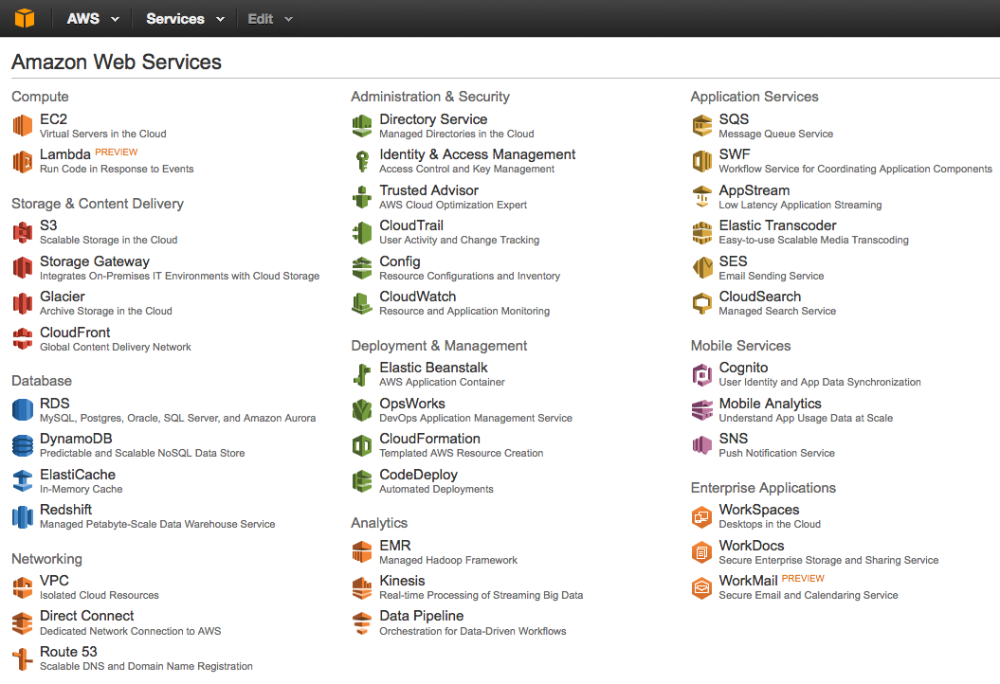
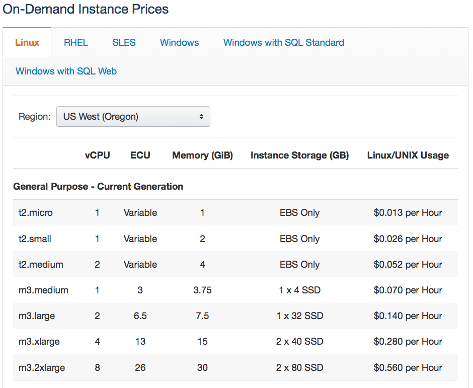

#Introduction to AWS Cloud Computing

###Preamble
Cloud computing allows users to quickly access an arbitrary amount of compute resources from a distance without the need to buy or maintain hardware themselves. There are many cloud computing services. This tutorial describes the use of Amazon's Web Services ([AWS](http://aws.amazon.com/)) elastic compute ([EC2](http://aws.amazon.com/ec2/)) resource. 

###Glossary and abbreviations
* AWS - Amazon Web Services 
* EC2 - Elastic Compute
* EBS - Elastic Block Storage
* S3 - 
* SSD - 
* HDD -
* Ephemeral storage - 

###What do I need to perform this tutorial?
To complete this tutorial, you will need a computer with access to the internet, a Web Browser, and a command line terminal application. We are going to access the Amazon EC2 console in your web browser and use it to configure and rent a remote computer from Amazon. We are then going to log into that computer from the command line. The computer you are working on can be almost anything and could be running Windows, Mac OSX, or Linux. The computer that we configure and rent from Amazon will be a Linux machine (though there are many other possibilities). You will use the terminal application on your computer to remotely log into this computer. The Amazon AWS computer you rent will be physically located somewhere that is likely far away from you. Depending on the 'Region' you select in Amazon AWS it could be physically located in one of several large compute warehouses in the North America, South America, Europe or Asia.   

There are two types of knowledge you will be exposed to in this tutorial.  First, use of the Amazon AWS EC2 web console. AWS documentation has a lot of specific jargon and technical concepts. Becoming proficient in AWS EC2 usage is like becoming a very particular kind of system administrator. Everything we do in a web browser using the EC2 console can also be accomplished at the command line using the [Amazon EC2 API tools](https://aws.amazon.com/developertools/Amazon-EC2/351). That is a subject for a more advanced tutorial.

Second, since we are going to create an Amazon instance that is running a Linux you will need to learn the basics of working at a Linux command line.  You will also need to become familiar with basic fundamentals of Linux system administration.
 
###Creating an account
In order to use AWS the first time, you will have to create an account. In order to create and run instances as described in this tutorial, you will need to associate a credit card with that account for billing purposes. Refer to the sections below on how billing works, how to estimate costs, and how to ensure that you have properly shut down everything that you could be billed for.

###Logging into the AWS console
To log into AWS, go to the [aws.amazon.com](http://aws.amazon.com/) and hit the [Sign In to the Console](https://console.aws.amazon.com/console/home) button as shown below.  Once you are logged in, select `EC2` from the list of Amazon Web Services. This tutorial is entirely focused on `EC2` (with some mention of `S3`) so the `EC2` console will be the starting point for many of the activities described below.   

***
AWS home:

***
AWS log in:

***
List of AWS services (select EC2 for this tutorial):

***
The AWS EC2 dashboard:

***

###What is a Region?
An AWS `Region` is set of compute resources that Amazon maintains. Each `Region` corresponds to a physical warehouse of compute hardware (computers, storage, networking, etc.). At the time of writing there are 8 regions: `(US East (N.Virginia)`, `US West (Oregon)`, `US West (N. California)`, `EU (Ireland)`, `EU (Frankfurt)`, `Asia Pacific (Singapore)`, `Asia Pacific (Tokyo)`, `Asia Pacific (Sydney)`, and `South America (Sao Paulo)`.  When you are logged into the AWS EC2 console you are always operating in one of these 8 regions. The current region is shown in the upper right corner of the console between the `User` menu and `Support` menu. It is important to pay attention to what region you are using for several reasons. First, when you launch an EC2 instance, this happens in a specific region. If you switch regions later, you will not see this instance. To find info in the console you will have to switch back to the region where that instance was created. The same reasoning applies for EBS volumes, AMIs, and other resources. These are tracked within a region. Second, the cost to use many AWS resources varies by region. Third, since each region is located in a different part of the world, this may influence network performance when you are accessing the instance and especially if you need to transfer large amounts of data in or out. For example, if you are working in the US and you are going to be uploading RNA-seq data to EC2 instances, it probably does not make sense to create those instances in `Asia Pacific (Sydney)`. Generally you should choose a region that is close to you or your users. But cost is also a consideration. It is important to be aware of regions when it comes to billing because if you are using resources in multiple regions it is easy to lose track of what you have running and you might wind up paying for something that you forgot to shut down. We will discuss billing and cost in further detail below.   

***
The `Region` menu in the EC2 console:

***

###How much does it cost?
Estimating the cost to use AWS resources can get complicated.  For the most part when you launch an EC2 instance or create an EBS or S3 volume, you are renting and reserving that resource. You will generally be charged for as long as you reserve that resource regardless of how you use it. For example, if you rent an 8-core machine with 1Tb of disk, and 64Gb of RAM, once you boot that machine you will be charged an hourly rate for as long as it is running. Even if you don't use it much. Even if you don't log into it at all. You have reserved it, it is being run for you, that resource can't be rented to someone else, you will pay for it. To get a sense of how much particular resource cost, spend some time examining the [AWS EC2 Pricing](http://aws.amazon.com/ec2/pricing/) list. Remember that `Region` can influence cost, so once you decide on the type of resources you need you should compare the cost of that resource across multiple regions. The pricing list is a extremely long page, broken down into several major categories: `Free Tier` (light weight resources you can experiment with for free), `On-Demand Instances` (rent by the hour, as we do in this tutorial), `Reserved Instances` (get a discount by renting longer term), `Reserved Instance Volume Discounts` (get further discounts by being an enterprise scale user), `Spot Instances` (bid for unused Amazon EC2 capacity), `Data transfer` (moving data in and out of EC2), `EBS-Optimized Instances` (for high performance file I/O), `Amazon Elastic Block Store` (rent storage volumes separately from Instances), etc.  Amazon provides a [Monthly Calculator](http://calculator.s3.amazonaws.com/index.html) to help you predict what your costs might look like.

For this tutorial, we are going to use an `On-Demand Instance`. Let look more closely at that section of the [pricing list](http://aws.amazon.com/ec2/pricing/) by referring to the example screenshot below. Note that we have selected `US West (Oregon)` as our region and we are looking at the `General Purpose` section of the table and assuming that we will launch a `Linux` instance. These tables enumerate the features of various computer configurations that you can rent by the hour.  Consider a particular instance type in this table, for example `m3.xlarge`.  For this instance we are told the number of CPUs that will be available on the machine (4), the amount of memory (15 GiB), the storage that will be pre-configured (2 x 80GB SSD drives), and the cost per hour to rent this machine ($0.140 per Hour).  Note how much jargon is used in these tables.  Memory is reported in GiB and storage is reported in GB ([1GiB ≈ 1.074GB](http://en.wikipedia.org/wiki/Gibibyte)).  For the number of CPUs we are told both the number of vCPUs (virtual CPU) and ECUs ([Elastic Compute Unit](http://aws.amazon.com/ec2/faqs/#What_is_an_EC2_Compute_Unit_and_why_did_you_introduce_it)).  A virtual CPU is a reference to the number of physical CPUs that are available on the machine.  It is referred to as `virtual` because we are actually creating a [virtual machine](http://en.wikipedia.org/wiki/Virtual_machine) when we create an EC2 instance. An ECU is a unit of computing that is meant to allow more accurate comparisons between machines that might have different generations of CPUs, recognizing that not all CPUs are created equally. The storage descriptions for EC2 instances may use the terms: `EBS only`, `SSD`, and `HDD`.  We will discuss EBS (Elastic Block Storage) in more detail below, but briefly EBS allows us to define one or more storage volumes of almost any size we wish and hardware details of that storage will be handled for us behind the scenes.  EBS volumes exist independently of an EC2 machine and can be moved from one machine to another and the contents can be stored and attached to multiple EC2 instances over time.  `SSD` refers to a solid state drive that is associated with the machine. `HDD` refers to a hard disk drive that is associated with the machine. `SSD` drives tend to be higher performance than `HDD` but also more expensive per unit of storage space.  When an instance indicates that it has `2 x 40 SSD` this means that is has two solid state drives, and each are 40GB in size.  The `SSD` and `HDD` drives associated with each instance and described in the pricing list are considered `ephemeral`.  We will discuss this important concept in more detail below.     

***
An example AWS EC2 price list:

***

###How does billing work? (I don't think I'm using anything, why am I getting a monthly bill)?
Generally you get an accounting of usage and cost on a 30 day cycle. 

###What is an AMI? How do I create a community AMI?

###What is a snapshot?

###What are Security Groups and how do they work?

###What is a Key Pair and how does it work?

###Storage volumes. What is ephemeral storage? What is EBS backed storage? What is S3 storage?

###How do storage volumes appear within a Linux instance on Amazon EC2?

###What is difference between the 'Start', 'Stop', 'Reboot', and 'Terminate' (Instance States)?

###How do I create my own AMI? 

###Acknowledgements
Creation of this tutorial on Amazon AWS EC2 was generously supported by [Amazon AWS Education grants](http://aws.amazon.com/grants/).