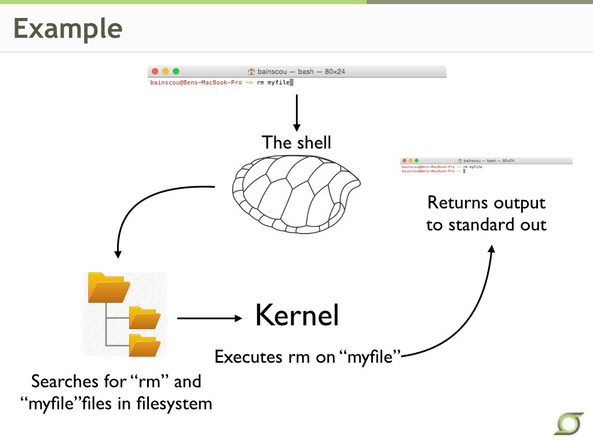

###Introduction(UNDER DEVELOPMENT)

UNIX is a command line operating system (OS)
* It is the backbone of popular graphical OS's like Apple's OS X and Linux

Unix is built on a simple modular philosophy
* UNIX is based on files and processes. In other words, all the OS 'sees' are files and processes even though there are directories and other types, they are all viewed by the OS as a file. This is useful as it makes it easier to pass files around the system.
* The OS provides a unified filesystem to facilitate communication between programs
* The OS operates on a set of simple programs that each provide a single well defined function.

###The Kernel

The kernel is the hub of the OS. It does all of the work behind the scenes.
* The kernel executes programs
* Allocates time and memory to programs

###The shell

The shell is the interface between the kernel and the user.
* Is a command line interpreter -- It has a defined syntax to execute processes
* Can be customized to user preferences
* Provides shortcuts for usability (tab completion)
* Stores a history of all commands run. Try `history` or press the up arrow in the terminal

